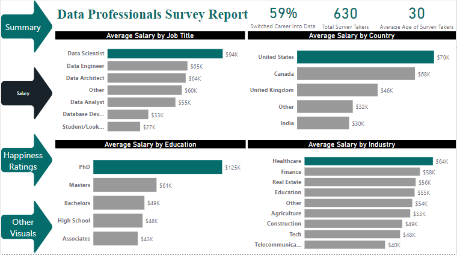
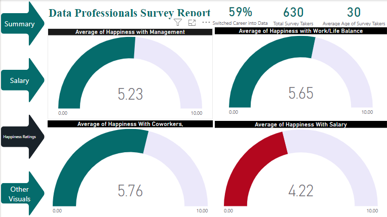
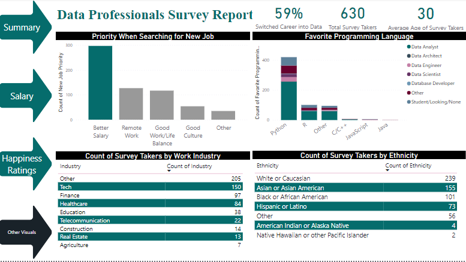

# Data Professionals Survey Report


## Introduction
In this Power BI project, I analyzed the results of a survey conducted among data professionals. The objective was to gain insights into the current state of the data
industry, including trends, challenges, and opportunities. The survey was conducted online, and it targeted data professionals such as data scientists, data analysts, 
and data engineers. The reports and dashboards include metrics such as the most popular data tools and technologies, salary level, and the most significant challenges 
facing data professionals today.

Overall, this project demonstrates how Power BI can be used to analyze survey data and provide valuable insights into the current state of the data industry. The results 
of this survey can be used by businesses and policymakers to make informed decisions about their data strategies and investments.

## PowerBI Concepts and Functions Applied
- DAX Measures
- Page Navigation
- COUNT()
- COUNTROWS()
- FILTER()
- AVERAGE

## Data Preparation
The survey data is available for download [here]( https://rb.gy/wn648). The survey questions covered a wide range of topics, including data technologies, tools, platforms,
salary, education, and happiness ratings.

## Data Processing
The following transformation was done on the data using Power Query Editor
- I removed columns that were not needed in the analysis
- For the Job title, Country, Favorite programming language, Ethnicity, New job priority columns, I split them into separate columns using delimiters. This was done to streamline the number of categorical outputs to the barest minimum.
- I replaced null values in the Happiness ratings columns with 0 for convenience
- I split the Current Yearly Salary column into two separate columns first, by Digits to Non-digits, then replacing “k and –“ with nothing. Then I changed the datatype of the columns to whole number before taking the average of both columns and finally multiplying by 1000. The following screenshot shows the original salary column and the transformed salary column.

The transformed dataset contained 630 rows of data and 21 columns. Since the survey contained only one table, there wasn’t any need for data modeling
After loading into Power BI desktop, I created the followng DAX Measures:
1. Average Age of Surevy Takers
```
Average Age of Survey Takers =
AVERAGE ( 'Data Professional Survey'[Age] )
```

2. Total Survey Takers
```
Total Survey Takers =
COUNT ( 'Data Professional Survey'[Unique ID] )
```

3. Number of respondents that switched career into data
```
Switched Career into Data =
COUNTROWS (
    FILTER (
        'Data Professional Survey',
        'Data Professional Survey'[Did you switch careers into Data?] = "Yes"
    )
) / 'Data Professional Survey'[Total Survey Takers]

```

## Analysis and Visualization

1. Salary Breakdown



2. Happiness Ratings



3. Other Visuals



## Key Takeaways from the analysis

1. Data Scientists, on average, earn the highest salary at 94,000 dollars
2. PhD holders earn the highest salary with an average of 125, 000 dollars
3. The United States of America is the country with the highest average salary in the data field
4. While the tech industry singlehandedly employs more data professionals, the healthcare industry pays the highest average salary among the survey respondents
5. The most used tool of choice for data professionals is python closely followed by R with data analysts being the highest users of these tools
6. Respondents generally reported being happy with their management, coworkers, and work/life balance but not with their current salary, this meant they would prioritize better salary if they were to change jobs
7. About 60% of respondents reported to have switched career from a different field into data field
8. The respondents are ethnically diverse with White or Caucasian and Asian or Asian American being the most ethnicities represented

## Recommendation for Business Leaders

1.	Encourage education and training: As a business leader, you should encourage and support education and training programs for your employees, which will equip them with the skills and knowledge needed to perform effectively in the data field.
2.	Consider the location of your business: As a business leader, you should consider the location of your business when hiring data professionals or setting salaries. This is particularly relevant if you operate globally, as salaries can vary significantly from one country to another.
3.	Explore opportunities in the healthcare industry: While the tech industry employs more data professionals, the healthcare industry pays the highest average salary. As a business leader, you should explore opportunities in the healthcare industry, particularly if you're looking to attract and retain top talent in the data field.
4.	Prioritize salary: Respondents reported being happy with their management, coworkers, and work/life balance but not with their current salary. As a business leader, you should prioritize competitive salaries to attract and retain top talent in the data field.
5.	Look beyond traditional backgrounds: With about 60% of respondents reported switching careers from a different field into the data field, you should consider looking beyond traditional backgrounds and recruiting individuals with transferable skills and a willingness to learn.
6.	Foster a diverse and inclusive culture: As a business leader, you should foster a diverse and inclusive culture that values and celebrates differences to attract and retain a diverse pool of talent in the data field.


